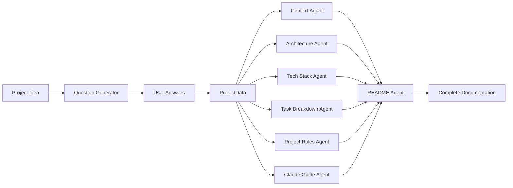

# DAVAI - AI Documentation Gene### Generate Complete Documentation

```bash
curl -X POST "http://localhost:8000/api/workflow/complete" \
  -H "Content-Type: application/json" \
  -d '{
    "project_idea": "A social media platform for developers",
    "answers": [
      "Web application",
      "Individual developers",
      "Real-time collaboration needed"
    ]
  }'
```

## Test with Postman

Download and import the [Postman Collection](backend/docs/postman.json) for comprehensive API testing.

## Generated Documentation Files

All generated documentation is automatically saved to `backend/temp/generated_docs/` with the following structure:

````text
backend/temp/generated_docs/
└── {project_name}_{timestamp}/
    ├── context.md
    ├── architecture.md
    ├── tech-stack-selection.md
    ├── TASK_BREAKDOWN.md
    ├── project-rules.md
    ├── CLAUDE.md
    ├── README.md
    └── metadata.json
```umentation AI) is a modular, agent-based system that generates comprehensive project documentation from a simple project idea using specialized AI agents.

## Table of Contents

- [Quick Start](#quick-start)
- [Workflow Summary](#workflow-summary)
- [Agents](#agents)
- [API Usage](#api-usage)
- [Architecture](#architecture)

## Quick Start

### Prerequisites

```bash
# Set environment variables
export OPENAI_API_KEY=your_openai_key
export ANTHROPIC_API_KEY=your_anthropic_key
export GOOGLE_API_KEY=your_google_key
````

### Start the Backend

```bash
cd backend
chmod +x start.sh
./start.sh
```

### Generate Complete Documentation

```bash
curl -X POST "http://localhost:8000/api/workflow/complete" \
  -H "Content-Type: application/json" \
  -d '{
    "project_idea": "A social media platform for developers",
    "answers": [
      "Web application",
      "Individual developers",
      "Real-time collaboration needed"
    ]
  }'
```

**📁 Generated files are automatically saved to `backend/temp/generated_docs/`**

### Browse Generated Projects

```bash
# List all saved projects
curl http://localhost:8000/api/workflow/saved-projects

# Get specific project files
curl http://localhost:8000/api/workflow/saved-projects/{project_folder_name}
```

## Workflow Summary



## Agents

| Agent                    | Input                  | Output                  | Purpose                                |
| ------------------------ | ---------------------- | ----------------------- | -------------------------------------- |
| **Question Generator**   | ProjectIdea            | Questions               | Generates clarifying questions         |
| **Suggestion Agent**     | ProjectData            | Suggestions             | Provides actionable project guidance   |
| **Context Agent**        | ProjectData            | context.md              | Creates project background and context |
| **Architecture Agent**   | ProjectData            | architecture.md         | Designs system architecture            |
| **Tech Stack Agent**     | ProjectData            | tech-stack-selection.md | Recommends technology stack            |
| **Task Breakdown Agent** | ProjectData            | TASK_BREAKDOWN.md       | Creates project task breakdown         |
| **Project Rules Agent**  | ProjectData            | project-rules.md        | Establishes coding standards           |
| **Claude Guide Agent**   | ProjectData            | CLAUDE.md               | Creates AI development guide           |
| **README Agent**         | ProjectData + All Docs | README.md               | Generates comprehensive README         |

### Agent Parameters

Each agent accepts:

- **Input**: `ProjectData(project_idea: str, questions: List[str], answers: List[str])`
- **Configuration**: `LlmConfig(provider: str, model: str, temperature: float, max_tokens: int)`
- **Output**: Generated markdown documentation

### Usage Example

```python
from agents.context_agent import ContextAgent

agent = ContextAgent()
result = agent.generate({
    "project_idea": "Social media platform for developers",
    "questions": ["What type of application?"],
    "answers": ["Web application"]
})
```

## API Usage

### System Health & Status

- `GET /health` - Basic health check
- `GET /status` - System status with service information (JSON)

### Complete Workflow

- `POST /api/workflow/complete` - Full documentation generation (saves files automatically)
- `GET /api/workflow/saved-projects` - List all saved documentation projects
- `GET /api/workflow/saved-projects/{project_name}` - Get specific project files

### Individual Agents

- `POST /api/question-generator/generate`
- `POST /api/suggestion-agent/generate`
- `POST /api/context/generate`
- `POST /api/architecture/generate`
- `POST /api/tech-stack/generate`
- `POST /api/task-breakdown/generate`
- `POST /api/project-rules/generate`
- `POST /api/claude-guide/generate`
- `POST /api/readme/generate`

### Documentation & Testing

- `GET /docs` - Interactive API documentation (Swagger UI)
- `GET /docs/postman.json` - Postman collection download
- **[📁 Postman Collection](backend/docs/postman.json)** - Import for comprehensive API testing

## Architecture

### Key Features

- **8 Specialized Agents**: Each focused on specific documentation type
- **Flexible Workflows**: Complete and partial documentation generation
- **Parallel Execution**: Efficient processing through concurrent agent execution
- **Modular Design**: Easy to extend with new agents
- **Multi-LLM Support**: OpenAI, Anthropic, Google providers

### Data Models

```python
# Input Models
ProjectIdea(idea: str, description: str)
Questions(questions: List[str])
ProjectData(project_idea: str, questions: List[str], answers: List[str])

# Output Models
Documentation(documents: Dict[str, str])
WorkflowResult(project_idea: str, steps: List[WorkflowStep], success: bool)
```

### Configuration

```python
LlmConfig(
    provider="openai",      # openai, anthropic, google
    model="gpt-4",         # Model name
    temperature=0.7,       # Creativity level
    max_tokens=2000       # Response length limit
)
```

---

_DAVAI enables rapid project documentation generation through AI-powered specialized agents, supporting autonomous development workflows._
