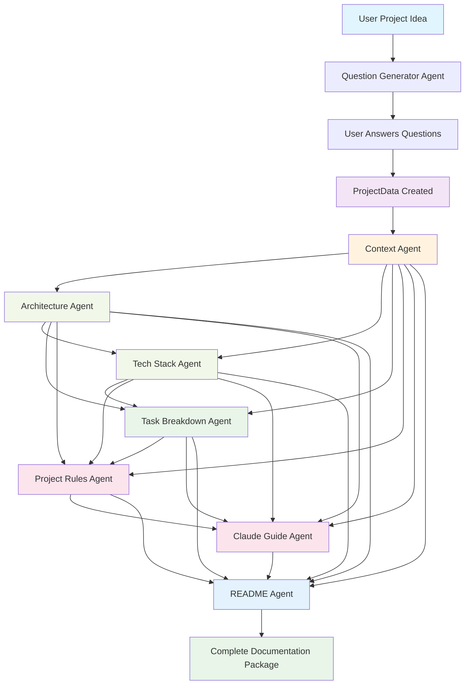

# DAVAI Agent Architecture Documentation

## Overview

The DAVAI backend implements a modular, agent-based architecture for generating comprehensive project documentation from a user-provided idea. Each agent is specialized for a specific documentation type and operates with clear input/output contracts and dependency relationships.

## Workflow Diagram



## Agent Dependencies & Execution Order

### 1. Sequential Dependency Chain

The workflow follows a carefully orchestrated dependency chain where each agent builds upon the outputs of previous agents:

#### Phase 1: Question Generation

1. **Question Generator Agent** (standalone)
   - Input: Raw project idea
   - Output: Clarifying questions
   - Dependencies: None

#### Phase 2: Context Analysis

2. **Context Agent** (standalone)
   - Input: Project idea + user answers
   - Output: Context analysis
   - Dependencies: None
   - Purpose: Provides foundation for all subsequent agents

#### Phase 3: Architecture Design

3. **Architecture Agent** (depends on Context)
   - Input: Project idea + user answers + **Context analysis**
   - Output: System architecture
   - Dependencies: Context Agent
   - Purpose: Informed by contextual understanding

#### Phase 4: Technology Selection

4. **Tech Stack Agent** (depends on Context + Architecture)
   - Input: Project idea + user answers + **Context + Architecture**
   - Output: Technology recommendations
   - Dependencies: Context Agent, Architecture Agent
   - Purpose: Tech choices informed by context and architecture

#### Phase 5: Project Planning

5. **Task Breakdown Agent** (depends on Context + Architecture + Tech Stack)
   - Input: Project idea + user answers + **Context + Architecture + Tech Stack**
   - Output: Task breakdown and milestones
   - Dependencies: Context Agent, Architecture Agent, Tech Stack Agent
   - Purpose: Planning informed by all technical decisions

#### Phase 6: Project Management

6. **Project Rules Agent** (depends on all previous)
   - Input: Project idea + user answers + **All previous outputs**
   - Output: Project guidelines and rules
   - Dependencies: Context, Architecture, Tech Stack, Task Breakdown
   - Purpose: Rules based on complete project understanding

#### Phase 7: Development Guide

7. **Claude Guide Agent** (depends on all previous)
   - Input: Project idea + user answers + **All previous outputs**
   - Output: Claude development guide
   - Dependencies: Context, Architecture, Tech Stack, Task Breakdown, Project Rules
   - Purpose: AI assistant guide with full project context

#### Phase 8: Documentation

8. **README Agent** (depends on all previous)
   - Input: Project idea + user answers + **All previous outputs**
   - Output: README and project documentation
   - Dependencies: All previous agents
   - Purpose: Comprehensive documentation with complete project picture

### 2. Dependency Matrix

| Agent          | Context | Architecture | Tech Stack | Task Breakdown | Project Rules | Claude Guide |
| -------------- | ------- | ------------ | ---------- | -------------- | ------------- | ------------ |
| Context        | -       | -            | -          | -              | -             | -            |
| Architecture   | ✅      | -            | -          | -              | -             | -            |
| Tech Stack     | ✅      | ✅           | -          | -              | -             | -            |
| Task Breakdown | ✅      | ✅           | ✅         | -              | -             | -            |
| Project Rules  | ✅      | ✅           | ✅         | ✅             | -             | -            |
| Claude Guide   | ✅      | ✅           | ✅         | ✅             | ✅            | -            |
| README         | ✅      | ✅           | ✅         | ✅             | ✅            | ✅           |

### 3. Benefits of Dependency Chain

#### Information Flow

- **Context Agent** provides foundational understanding for all subsequent agents
- **Architecture Agent** gets contextual insights to make better design decisions
- **Tech Stack Agent** chooses technologies that fit both context and architecture
- **Task Breakdown Agent** creates realistic plans based on actual technical requirements
- **Project Rules** and **Claude Guide** benefit from complete project understanding
- **README Agent** can create comprehensive documentation with full project picture

#### Quality Improvements

- More informed decision-making at each step
- Consistency across all documentation
- Reduced contradictions between different documentation types
- More realistic and practical recommendations
- Better alignment between technical choices and project goals
- Task Breakdown Agent
- Project Rules Agent
- Claude Guide Agent

## Agent Specifications

### 1. Question Generator Agent

**Purpose**: Generates clarifying questions to gather comprehensive project requirements.

**Input Schema**:

```python
class ProjectIdea(BaseModel):
    idea: str = Field(..., description="Original project idea description")
    description: str = Field(..., description="Detailed project description")
```

**Output Schema**:

```python
class Questions(BaseModel):
    questions: List[str] = Field(..., description="List of clarifying questions")
```

**Dependencies**: None (entry point)

**Process**:

1. Analyzes the initial project idea
2. Generates 5-10 strategic questions covering:
   - Target audience and users
   - Technical requirements and constraints
   - Feature priorities and scope
   - Integration needs
   - Performance and scalability requirements

---

### 2. Context Agent

**Purpose**: Generates project context and background documentation.

**Input Schema**:

```python
class ProjectData(BaseModel):
    project_idea: str = Field(..., description="Original project idea")
    questions: List[str] = Field(..., description="Clarifying questions")
    answers: List[str] = Field(..., description="User answers to questions")
```

**Output Schema**:

```python
Dict[str, str]  # {"context.md": "content"}
```

**Dependencies**: ProjectData (requires question answers)

**Process**:

1. Analyzes project idea and user answers
2. Creates comprehensive context documentation including:
   - Problem statement and motivation
   - Target audience analysis
   - Business requirements
   - Success criteria

---

### 3. Architecture Agent

**Purpose**: Designs system architecture and technical structure.

**Input Schema**:

```python
class ProjectData(BaseModel):
    project_idea: str = Field(..., description="Original project idea")
    questions: List[str] = Field(..., description="Clarifying questions")
    answers: List[str] = Field(..., description="User answers to questions")
```

**Output Schema**:

```python
Dict[str, str]  # {"architecture.md": "content"}
```

**Dependencies**: ProjectData (requires question answers)

**Process**:

1. Designs system architecture based on requirements
2. Creates documentation covering:
   - System components and modules
   - Data flow and interactions
   - Integration patterns
   - Scalability considerations

---

### 4. Tech Stack Agent

**Purpose**: Recommends optimal technology stack and tools.

**Input Schema**:

```python
class ProjectData(BaseModel):
    project_idea: str = Field(..., description="Original project idea")
    questions: List[str] = Field(..., description="Clarifying questions")
    answers: List[str] = Field(..., description="User answers to questions")
```

**Output Schema**:

```python
Dict[str, str]  # {"tech-stack-selection.md": "content"}
```

**Dependencies**: ProjectData (requires question answers)

**Process**:

1. Analyzes technical requirements from user answers
2. Recommends appropriate technologies for:
   - Frontend frameworks and libraries
   - Backend technologies and databases
   - DevOps and deployment tools
   - Third-party services and APIs

---

### 5. Task Breakdown Agent

**Purpose**: Creates detailed project breakdown and task organization.

**Input Schema**:

```python
class ProjectData(BaseModel):
    project_idea: str = Field(..., description="Original project idea")
    questions: List[str] = Field(..., description="Clarifying questions")
    answers: List[str] = Field(..., description="User answers to questions")
```

**Output Schema**:

```python
Dict[str, str]  # {"TASK_BREAKDOWN.md": "content"}
```

**Dependencies**: ProjectData (requires question answers)

**Process**:

1. Breaks down project into manageable tasks
2. Creates structured task documentation with:
   - Feature-based task organization
   - Priority levels and dependencies
   - Estimated effort and timelines
   - Milestone definitions

---

### 6. Project Rules Agent

**Purpose**: Establishes coding standards, conventions, and project guidelines.

**Input Schema**:

```python
class ProjectData(BaseModel):
    project_idea: str = Field(..., description="Original project idea")
    questions: List[str] = Field(..., description="Clarifying questions")
    answers: List[str] = Field(..., description="User answers to questions")
```

**Output Schema**:

```python
Dict[str, str]  # {"project-rules.md": "content"}
```

**Dependencies**: ProjectData (requires question answers)

**Process**:

1. Defines project standards based on tech stack and requirements
2. Creates guidelines covering:
   - Coding conventions and style guides
   - File organization and naming
   - Git workflow and branch strategy
   - Testing and quality assurance rules

---

### 7. Claude Guide Agent

**Purpose**: Creates AI-assisted development guide for working with Claude/LLMs.

**Input Schema**:

```python
class ProjectData(BaseModel):
    project_idea: str = Field(..., description="Original project idea")
    questions: List[str] = Field(..., description="Clarifying questions")
    answers: List[str] = Field(..., description="User answers to questions")
```

**Output Schema**:

```python
Dict[str, str]  # {"CLAUDE.md": "content"}
```

**Dependencies**: ProjectData (requires question answers)

**Process**:

1. Creates AI collaboration guidelines
2. Provides guidance on:
   - Effective prompting strategies
   - Code review and AI assistance workflows
   - Best practices for AI-human collaboration
   - Project-specific AI usage patterns

---

### 8. README Agent

**Purpose**: Generates comprehensive project README with all gathered information.

**Input Schema**:

```python
class ProjectData(BaseModel):
    project_idea: str = Field(..., description="Original project idea")
    questions: List[str] = Field(..., description="Clarifying questions")
    answers: List[str] = Field(..., description="User answers to questions")
```

**Output Schema**:

```python
Dict[str, str]  # {"README.md": "content"}
```

**Dependencies**:

- ProjectData (requires question answers)
- **All other agent outputs** (context, architecture, tech stack, etc.)

**Process**:

1. Synthesizes information from all previous agents
2. Creates comprehensive README including:
   - Project overview and description
   - Installation and setup instructions
   - Usage examples and documentation
   - Contributing guidelines
   - Links to detailed documentation files

---

## Workflow Execution Patterns

### 1. Complete Workflow

```
POST /api/workflow/complete
```

Executes the full documentation generation pipeline:

1. Generate questions → User answers → Create ProjectData
2. Execute all documentation agents in parallel
3. Generate README with synthesized information
4. Return complete documentation package

### 2. Individual Agent Execution

```
POST /api/{agent-name}/generate
```

Executes a single agent independently (useful for testing or regenerating specific documentation).

### 3. Parallel Documentation Generation

```
POST /api/workflow/generate-all-documentation
```

Executes all documentation agents in parallel given existing ProjectData.

## Data Models

### Core Models

```python
# Input Models
class ProjectIdea(BaseModel):
    idea: str
    description: str

class Questions(BaseModel):
    questions: List[str]

class ProjectData(BaseModel):
    project_idea: str
    questions: List[str]
    answers: List[str]

# Output Models
class Documentation(BaseModel):
    documents: Dict[str, str]  # filename -> content

class WorkflowStep(BaseModel):
    step_name: str
    input_data: Dict
    output_data: Dict
    success: bool
    error_message: str = None

class WorkflowResult(BaseModel):
    project_idea: str
    steps: List[WorkflowStep]
    final_documentation: Dict[str, str] = None
    success: bool
    total_duration: float
```

## Error Handling

Each agent implements comprehensive error handling:

- **Input validation** using Pydantic models
- **LLM failure recovery** with retry mechanisms
- **Graceful degradation** with fallback prompts
- **Detailed logging** for debugging and monitoring

## Extensibility

The architecture supports easy extension:

- **New agents** can be added by inheriting from `BaseAgent`
- **Custom workflows** can be created by combining agents
- **Agent ordering** can be modified in the workflow orchestrator
- **Output formats** can be extended through model updates
