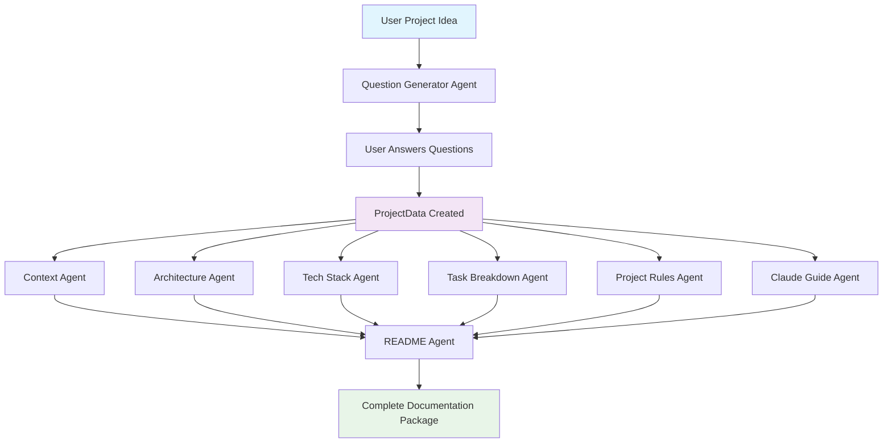

# DAVAI Agent Architecture Documentation

## Overview

The DAVAI backend implements a modular, agent-based architecture for generating comprehensive project documentation from a user-provided idea. Each agent is specialized for a specific documentation type and operates with clear input/output contracts.

## Workflow Diagram



## Agent Dependencies

### Sequential Dependencies
1. **Question Generator** → User Input → **ProjectData Creation**
2. **All Documentation Agents** (parallel execution with ProjectData)
3. **README Agent** (requires outputs from all documentation agents)

### Parallel Execution
The following agents can run in parallel after ProjectData is created:
- Context Agent
- Architecture Agent
- Tech Stack Agent
- Task Breakdown Agent
- Project Rules Agent
- Claude Guide Agent

## Agent Specifications

### 1. Question Generator Agent

**Purpose**: Generates clarifying questions to gather comprehensive project requirements.

**Input Schema**:
```python
class ProjectIdea(BaseModel):
    idea: str = Field(..., description="Original project idea description")
    description: str = Field(..., description="Detailed project description")
```

**Output Schema**:
```python
class Questions(BaseModel):
    questions: List[str] = Field(..., description="List of clarifying questions")
```

**Dependencies**: None (entry point)

**Process**:
1. Analyzes the initial project idea
2. Generates 5-10 strategic questions covering:
   - Target audience and users
   - Technical requirements and constraints
   - Feature priorities and scope
   - Integration needs
   - Performance and scalability requirements

---

### 2. Context Agent

**Purpose**: Generates project context and background documentation.

**Input Schema**:
```python
class ProjectData(BaseModel):
    project_idea: str = Field(..., description="Original project idea")
    questions: List[str] = Field(..., description="Clarifying questions")
    answers: List[str] = Field(..., description="User answers to questions")
```

**Output Schema**:
```python
Dict[str, str]  # {"context.md": "content"}
```

**Dependencies**: ProjectData (requires question answers)

**Process**:
1. Analyzes project idea and user answers
2. Creates comprehensive context documentation including:
   - Problem statement and motivation
   - Target audience analysis
   - Business requirements
   - Success criteria

---

### 3. Architecture Agent

**Purpose**: Designs system architecture and technical structure.

**Input Schema**:
```python
class ProjectData(BaseModel):
    project_idea: str = Field(..., description="Original project idea")
    questions: List[str] = Field(..., description="Clarifying questions")
    answers: List[str] = Field(..., description="User answers to questions")
```

**Output Schema**:
```python
Dict[str, str]  # {"architecture.md": "content"}
```

**Dependencies**: ProjectData (requires question answers)

**Process**:
1. Designs system architecture based on requirements
2. Creates documentation covering:
   - System components and modules
   - Data flow and interactions
   - Integration patterns
   - Scalability considerations

---

### 4. Tech Stack Agent

**Purpose**: Recommends optimal technology stack and tools.

**Input Schema**:
```python
class ProjectData(BaseModel):
    project_idea: str = Field(..., description="Original project idea")
    questions: List[str] = Field(..., description="Clarifying questions")
    answers: List[str] = Field(..., description="User answers to questions")
```

**Output Schema**:
```python
Dict[str, str]  # {"tech-stack-selection.md": "content"}
```

**Dependencies**: ProjectData (requires question answers)

**Process**:
1. Analyzes technical requirements from user answers
2. Recommends appropriate technologies for:
   - Frontend frameworks and libraries
   - Backend technologies and databases
   - DevOps and deployment tools
   - Third-party services and APIs

---

### 5. Task Breakdown Agent

**Purpose**: Creates detailed project breakdown and task organization.

**Input Schema**:
```python
class ProjectData(BaseModel):
    project_idea: str = Field(..., description="Original project idea")
    questions: List[str] = Field(..., description="Clarifying questions")
    answers: List[str] = Field(..., description="User answers to questions")
```

**Output Schema**:
```python
Dict[str, str]  # {"TASK_BREAKDOWN.md": "content"}
```

**Dependencies**: ProjectData (requires question answers)

**Process**:
1. Breaks down project into manageable tasks
2. Creates structured task documentation with:
   - Feature-based task organization
   - Priority levels and dependencies
   - Estimated effort and timelines
   - Milestone definitions

---

### 6. Project Rules Agent

**Purpose**: Establishes coding standards, conventions, and project guidelines.

**Input Schema**:
```python
class ProjectData(BaseModel):
    project_idea: str = Field(..., description="Original project idea")
    questions: List[str] = Field(..., description="Clarifying questions")
    answers: List[str] = Field(..., description="User answers to questions")
```

**Output Schema**:
```python
Dict[str, str]  # {"project-rules.md": "content"}
```

**Dependencies**: ProjectData (requires question answers)

**Process**:
1. Defines project standards based on tech stack and requirements
2. Creates guidelines covering:
   - Coding conventions and style guides
   - File organization and naming
   - Git workflow and branch strategy
   - Testing and quality assurance rules

---

### 7. Claude Guide Agent

**Purpose**: Creates AI-assisted development guide for working with Claude/LLMs.

**Input Schema**:
```python
class ProjectData(BaseModel):
    project_idea: str = Field(..., description="Original project idea")
    questions: List[str] = Field(..., description="Clarifying questions")
    answers: List[str] = Field(..., description="User answers to questions")
```

**Output Schema**:
```python
Dict[str, str]  # {"CLAUDE.md": "content"}
```

**Dependencies**: ProjectData (requires question answers)

**Process**:
1. Creates AI collaboration guidelines
2. Provides guidance on:
   - Effective prompting strategies
   - Code review and AI assistance workflows
   - Best practices for AI-human collaboration
   - Project-specific AI usage patterns

---

### 8. README Agent

**Purpose**: Generates comprehensive project README with all gathered information.

**Input Schema**:
```python
class ProjectData(BaseModel):
    project_idea: str = Field(..., description="Original project idea")
    questions: List[str] = Field(..., description="Clarifying questions")
    answers: List[str] = Field(..., description="User answers to questions")
```

**Output Schema**:
```python
Dict[str, str]  # {"README.md": "content"}
```

**Dependencies**: 
- ProjectData (requires question answers)
- **All other agent outputs** (context, architecture, tech stack, etc.)

**Process**:
1. Synthesizes information from all previous agents
2. Creates comprehensive README including:
   - Project overview and description
   - Installation and setup instructions
   - Usage examples and documentation
   - Contributing guidelines
   - Links to detailed documentation files

---

## Workflow Execution Patterns

### 1. Complete Workflow
```
POST /api/workflow/complete
```
Executes the full documentation generation pipeline:
1. Generate questions → User answers → Create ProjectData
2. Execute all documentation agents in parallel
3. Generate README with synthesized information
4. Return complete documentation package

### 2. Individual Agent Execution
```
POST /api/{agent-name}/generate
```
Executes a single agent independently (useful for testing or regenerating specific documentation).

### 3. Parallel Documentation Generation
```
POST /api/workflow/generate-all-documentation
```
Executes all documentation agents in parallel given existing ProjectData.

## Data Models

### Core Models

```python
# Input Models
class ProjectIdea(BaseModel):
    idea: str
    description: str

class Questions(BaseModel):
    questions: List[str]

class ProjectData(BaseModel):
    project_idea: str
    questions: List[str]
    answers: List[str]

# Output Models
class Documentation(BaseModel):
    documents: Dict[str, str]  # filename -> content

class WorkflowStep(BaseModel):
    step_name: str
    input_data: Dict
    output_data: Dict
    success: bool
    error_message: str = None

class WorkflowResult(BaseModel):
    project_idea: str
    steps: List[WorkflowStep]
    final_documentation: Dict[str, str] = None
    success: bool
    total_duration: float
```

## Error Handling

Each agent implements comprehensive error handling:
- **Input validation** using Pydantic models
- **LLM failure recovery** with retry mechanisms
- **Graceful degradation** with fallback prompts
- **Detailed logging** for debugging and monitoring

## Extensibility

The architecture supports easy extension:
- **New agents** can be added by inheriting from `BaseAgent`
- **Custom workflows** can be created by combining agents
- **Agent ordering** can be modified in the workflow orchestrator
- **Output formats** can be extended through model updates
