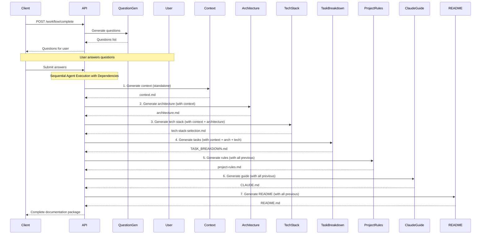

# DAVAI API Workflow Documentation

## API Endpoints Overview

The DAVAI backend exposes RESTful endpoints for both individual agent execution and complete workflow orchestration.

## Base URL

```
http://localhost:8000/api
```

## Workflow Endpoints

### 1. Complete Documentation Generation

**Endpoint**: `POST /workflow/complete`

**Description**: Executes the complete documentation generation workflow from project idea to final documentation package.

**Request Body**:

```json
{
  "project_idea": {
    "idea": "A social media platform for developers",
    "description": "A platform where developers can share code snippets, collaborate on projects, and get peer reviews"
  },
  "user_answers": [
    "Web application with mobile responsive design",
    "Individual developers and small teams",
    "Real-time collaboration features needed",
    "Integration with GitHub and GitLab",
    "Support for 1000+ concurrent users"
  ]
}
```

**Response**:

```json
{
  "project_idea": "A social media platform for developers",
  "steps": [
    {
      "step_name": "question_generation",
      "input_data": { "idea": "..." },
      "output_data": { "questions": ["..."] },
      "success": true,
      "error_message": null
    }
  ],
  "final_documentation": {
    "README.md": "# Developer Social Platform\n...",
    "architecture.md": "# System Architecture\n...",
    "context.md": "# Project Context\n...",
    "tech-stack-selection.md": "# Technology Stack\n...",
    "TASK_BREAKDOWN.md": "# Task Breakdown\n...",
    "project-rules.md": "# Project Rules\n...",
    "CLAUDE.md": "# AI Development Guide\n..."
  },
  "success": true,
  "total_duration": 45.2
}
```

### 2. Health Check

**Endpoint**: `GET /workflow/health`

**Description**: Checks the health status of the workflow service.

**Response**:

```json
{
  "status": "healthy",
  "message": "DAVAI POC Workflow API is running",
  "version": "0.1.0"
}
```

**Response**:

```json
{
  "documents": {
    "context.md": "# Project Context\n...",
    "architecture.md": "# System Architecture\n...",
    "tech-stack-selection.md": "# Technology Stack\n...",
    "TASK_BREAKDOWN.md": "# Task Breakdown\n...",
    "project-rules.md": "# Project Rules\n...",
    "CLAUDE.md": "# AI Development Guide\n...",
    "README.md": "# Developer Social Platform\n..."
  }
}
```

## Individual Agent Endpoints

Each agent can be executed independently for testing or regenerating specific documentation.

### Question Generator

**Endpoint**: `POST /question-generator/generate`

**Request Body**:

```json
{
  "idea": "A social media platform for developers",
  "description": "A platform where developers can share code snippets, collaborate on projects, and get peer reviews"
}
```

**Response**:

```json
{
  "questions": [
    "What type of application are you building (web, mobile, desktop)?",
    "Who is your target audience?",
    "What are the core features you want to include?",
    "Do you need real-time features like chat or live collaboration?",
    "What's your expected user scale and performance requirements?"
  ]
}
```

### Context Agent

**Endpoint**: `POST /context/generate`

**Request Body**:

```json
{
  "project_idea": "A social media platform for developers",
  "questions": [
    "What type of application...",
    "Who is your target audience..."
  ],
  "answers": ["Web application...", "Individual developers..."]
}
```

**Response**:

```json
{
  "context.md": "# Project Context\n\n## Problem Statement\n..."
}
```

### Architecture Agent

**Endpoint**: `POST /architecture/generate`

**Request Body**: Same as Context Agent

**Response**:

```json
{
  "architecture.md": "# System Architecture\n\n## Overview\n..."
}
```

### Tech Stack Agent

**Endpoint**: `POST /tech-stack/generate`

**Request Body**: Same as Context Agent

**Response**:

```json
{
  "tech-stack-selection.md": "# Technology Stack Selection\n\n## Frontend\n..."
}
```

### Task Breakdown Agent

**Endpoint**: `POST /task-breakdown/generate`

**Request Body**: Same as Context Agent

**Response**:

```json
{
  "TASK_BREAKDOWN.md": "# Task Breakdown\n\n## Phase 1: Foundation\n..."
}
```

### Project Rules Agent

**Endpoint**: `POST /project-rules/generate`

**Request Body**: Same as Context Agent

**Response**:

```json
{
  "project-rules.md": "# Project Rules and Guidelines\n\n## Coding Standards\n..."
}
```

### Claude Guide Agent

**Endpoint**: `POST /claude-guide/generate`

**Request Body**: Same as Context Agent

**Response**:

```json
{
  "CLAUDE.md": "# AI Development Guide\n\n## Working with Claude\n..."
}
```

### README Agent

**Endpoint**: `POST /readme/generate`

**Request Body**: Same as Context Agent

**Response**:

```json
{
  "README.md": "# Developer Social Platform\n\n## Overview\n..."
}
```

## Error Responses

All endpoints return consistent error responses:

### 400 Bad Request

```json
{
  "detail": "Invalid input data",
  "errors": [
    {
      "field": "project_idea",
      "message": "Field is required"
    }
  ]
}
```

### 500 Internal Server Error

```json
{
  "detail": "Internal server error",
  "error": "LLM service unavailable"
}
```

## Workflow Execution Flow

### Sequential Workflow (Complete)



## Configuration

        API->>Agents: Generate guide
    and README Agent
        API->>Agents: Generate README
    end

    Agents-->>API: All documentation
    API-->>Client: Complete documentation package

````

## Configuration

### LLM Configuration

Agents can be configured with different LLM providers:

```json
{
  "provider": "openai",
  "model": "gpt-4",
  "temperature": 0.7,
  "max_tokens": 2000
}
````

Supported providers:

- `openai` (GPT-3.5, GPT-4)
- `anthropic` (Claude 3 Haiku, Sonnet, Opus)
- `google` (Gemini Pro)

### API Keys

Required environment variables:

```bash
OPENAI_API_KEY=your_openai_key
ANTHROPIC_API_KEY=your_anthropic_key
GOOGLE_API_KEY=your_google_key
```

## Rate Limiting

- **Individual agents**: 10 requests/minute
- **Complete workflow**: 5 requests/hour
- **Parallel documentation**: 3 requests/hour

## Monitoring

All endpoints provide execution metrics:

- Response time
- Token usage
- Success/failure rates
- Agent performance statistics

Access metrics at: `GET /metrics`
