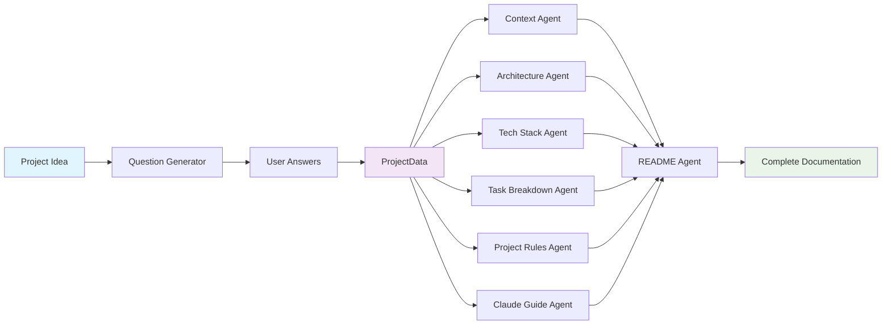

# DAVAI Documentation Overview

## Quick Navigation

This directory contains comprehensive documentation for the DAVAI agent-based documentation generation system.

### 📚 Documentation Files

| Document                                         | Purpose                                                     | Target Audience                    |
| ------------------------------------------------ | ----------------------------------------------------------- | ---------------------------------- |
| [`AGENT_ARCHITECTURE.md`](AGENT_ARCHITECTURE.md) | Complete agent architecture, dependencies, and data flows   | Developers, System Architects      |
| [`API_WORKFLOW.md`](API_WORKFLOW.md)             | REST API endpoints, request/response schemas, and workflows | API Consumers, Frontend Developers |
| [`AGENT_PROMPTS.md`](AGENT_PROMPTS.md)           | Detailed analysis of agent prompts and instructions         | Prompt Engineers, AI Specialists   |
| [`README.md`](README.md)                         | This overview document                                      | All Users                          |

## System Overview

DAVAI (Documentation AI) is a modular, agent-based system that generates comprehensive project documentation from a simple project idea. The system uses specialized AI agents to create different types of documentation in a coordinated workflow.

### Key Features

- **🤖 8 Specialized Agents**: Each focused on a specific documentation type
- **🔄 Flexible Workflows**: Support for both complete and partial documentation generation
- **📊 Clear Dependencies**: Well-defined input/output relationships between agents
- **🚀 Parallel Execution**: Efficient processing through concurrent agent execution
- **🔧 Modular Design**: Easy to extend with new agents or modify existing ones

## Agent Workflow Summary



## Agent Summary

| Agent                    | Input Dependencies     | Output                  | Purpose                                |
| ------------------------ | ---------------------- | ----------------------- | -------------------------------------- |
| **Question Generator**   | ProjectIdea            | Questions               | Generates clarifying questions         |
| **Context Agent**        | ProjectData            | context.md              | Creates project background and context |
| **Architecture Agent**   | ProjectData            | architecture.md         | Designs system architecture            |
| **Tech Stack Agent**     | ProjectData            | tech-stack-selection.md | Recommends technology stack            |
| **Task Breakdown Agent** | ProjectData            | TASK_BREAKDOWN.md       | Creates project task breakdown         |
| **Project Rules Agent**  | ProjectData            | project-rules.md        | Establishes coding standards           |
| **Claude Guide Agent**   | ProjectData            | CLAUDE.md               | Creates AI development guide           |
| **README Agent**         | ProjectData + All Docs | README.md               | Generates comprehensive README         |

## Data Models

### Core Input/Output Types

```python
# Input Models
ProjectIdea(idea: str, description: str)
Questions(questions: List[str])
ProjectData(project_idea: str, questions: List[str], answers: List[str])

# Output Models
Documentation(documents: Dict[str, str])
WorkflowResult(project_idea: str, steps: List[WorkflowStep], success: bool, total_duration: float)
```

## API Endpoints Summary

### Workflow Endpoints

- `POST /api/workflow/complete` - Full documentation generation
- `POST /api/workflow/generate-all-documentation` - Parallel documentation generation
- `GET /api/workflow/health` - System health check

### Individual Agent Endpoints

- `POST /api/question-generator/generate`
- `POST /api/context/generate`
- `POST /api/architecture/generate`
- `POST /api/tech-stack/generate`
- `POST /api/task-breakdown/generate`
- `POST /api/project-rules/generate`
- `POST /api/claude-guide/generate`
- `POST /api/readme/generate`

## Usage Examples

### Complete Workflow

```bash
curl -X POST "http://localhost:8000/api/workflow/complete" \
  -H "Content-Type: application/json" \
  -d '{
    "project_idea": {
      "idea": "A social media platform for developers",
      "description": "Platform for code sharing and collaboration"
    },
    "user_answers": [
      "Web application",
      "Individual developers",
      "Real-time collaboration needed"
    ]
  }'
```

### Individual Agent

```bash
curl -X POST "http://localhost:8000/api/context/generate" \
  -H "Content-Type: application/json" \
  -d '{
    "project_idea": "A social media platform for developers",
    "questions": ["What type of application?"],
    "answers": ["Web application"]
  }'
```

## Architecture Benefits

### Modularity

- Each agent is independently testable and maintainable
- Easy to modify or replace individual agents
- Clear separation of concerns

### Scalability

- Parallel execution of independent agents
- Configurable LLM providers and models
- Horizontal scaling support

### Extensibility

- Simple to add new agent types
- Flexible workflow orchestration
- Plugin-like architecture

### Quality

- Specialized prompts for each documentation type
- Consistent output formatting
- Comprehensive error handling

## Development Workflow

### Adding a New Agent

1. **Create Agent Directory**: `agents/new_agent/`
2. **Implement Agent Class**: Inherit from `BaseAgent`
3. **Create Prompt File**: `new_agent_prompt.md`
4. **Add Route Handler**: `routes/agents/new_agent_routes.py`
5. **Update Orchestrator**: Add to workflow execution
6. **Write Tests**: Unit and integration tests

### Modifying Existing Agents

1. **Update Prompt**: Modify the agent's prompt file
2. **Test Changes**: Verify output quality and format
3. **Update Documentation**: Reflect changes in docs
4. **Version Control**: Track prompt changes

## Monitoring and Debugging

### Logging

- Comprehensive logging at each workflow step
- Agent execution timing and success rates
- Token usage and cost tracking

### Health Checks

- Individual agent health status
- LLM provider connectivity
- System resource utilization

### Error Handling

- Graceful degradation on agent failures
- Retry mechanisms for transient errors
- Detailed error reporting and recovery

## Configuration

### Environment Variables

```bash
OPENAI_API_KEY=your_openai_key
ANTHROPIC_API_KEY=your_anthropic_key
GOOGLE_API_KEY=your_google_key
LOG_LEVEL=INFO
```

### LLM Configuration

```python
LlmConfig(
    provider="openai",      # openai, anthropic, google
    model="gpt-4",         # Model name
    temperature=0.7,       # Creativity level
    max_tokens=2000       # Response length limit
)
```

## Getting Started

1. **Read Architecture**: Start with [`AGENT_ARCHITECTURE.md`](AGENT_ARCHITECTURE.md)
2. **Explore APIs**: Review [`API_WORKFLOW.md`](API_WORKFLOW.md)
3. **Understand Prompts**: Study [`AGENT_PROMPTS.md`](AGENT_PROMPTS.md)
4. **Set Up Environment**: Configure API keys and dependencies
5. **Run Examples**: Test with sample project ideas

## Support and Contribution

For questions, issues, or contributions:

- Review the architecture documentation first
- Check existing agent implementations for patterns
- Follow the established coding standards and patterns
- Add comprehensive tests for new functionality

## Version History

- **v1.0.0**: Initial modular agent-based architecture
- Comprehensive documentation generation workflow
- Support for multiple LLM providers
- Parallel agent execution capabilities
